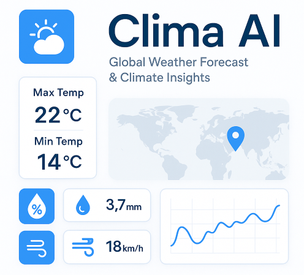

# Clima AI – Global Weather Forecast & Climate Insights

> An intelligent, ML-powered weather platform built with Streamlit that analyzes, predicts, and recommends weather-based actions across global cities.

---

## About the Project

**Clima AI** is a full-featured weather dashboard that combines **live weather updates**, **machine learning predictions**, and **climate trend analytics** in a clean, modern UI. Built with RandomForestRegressor and integrated with WeatherAPI + Open-Meteo, the app is ideal for educational, research, and real-world forecasting use cases.


---

## Preview



## Demo

<video width="800" controls>
  <source src="assests/climaai_demo.webm" type="video/webm">
  Your browser does not support the video tag.
</video>

---

## Features at a Glance

| Feature | Description |
|--------|-------------|
| **Live Weather Data** | Real-time weather metrics via WeatherAPI |
| **Temperature Predictor** | Predicts next-day max temp using ML |
| **Historical Climate Analysis** | Insights on temp, wind, rain, and humidity |
| **Anomaly Detection** | Z-score-based outlier spotting by feature |
| **Smart Recommendations** | Weather-based health/travel suggestions |
| **Trends & Forecasting** | Monthly and yearly analytics |
| **Custom Forecast** | Predict temp using user-defined weather parameters |
| **Downloadable Dataset** | Cleaned and prepared CSV data output |

---

## Machine Learning Workflow

- Weather data collected via Open-Meteo API
- Daily aggregation (Max, Min, Rain, Wind, Humidity)
- Z-Score anomaly detection
- Feature columns selected: ['temp_max', 'temp_min', 'rain', 'wind', 'humidity']
- Trained model: `RandomForestRegressor`
- Target: Next-day `temp_max` (shifted column)

---

## Project Structure

```
ClimaAI/
├── app.py                    # Streamlit main app
├── assets/
│   └── climaai_preview.png   # App screenshot / thumbnail
├── requirements.txt          # Python dependencies
├── README.md                 # Project documentation
```

---

## 🛠️ Tech Stack

- **Frontend/UI**: Streamlit
- **Backend/ML**: Python, scikit-learn, pandas, numpy
- **Visualization**: Plotly, Matplotlib
- **Model**: RandomForestRegressor
- **APIs**: Open-Meteo, WeatherAPI
- **Geocoding**: geopy (Nominatim)

---

## How to Run the Project

### 1. Clone the repository
```bash
git clone https://github.com/farhannaushad08/Clima-AI.git
cd Clima-AI
```

### 2. Install dependencies
```bash
pip install -r requirements.txt
```

### 3. Add API Key

Create a `.streamlit/secrets.toml` file:
```toml
WEATHERAPI_KEY = "your_api_key_here"
```

### 4. Launch the app
```bash
streamlit run app.py
```

---

## Deployment

You can deploy Clima AI on [Streamlit Cloud](https://streamlit.io/cloud) or any cloud service.

**Steps:**
- Upload to GitHub
- Create a new Streamlit app
- Set `app.py` as the entry file
- Add your WeatherAPI key via secret manager

---

## Final Note

**Clima AI** turns complex weather data into visual, actionable insights using AI. It’s perfect for curious minds, students, researchers, and developers exploring applied machine learning in climate systems.

---

